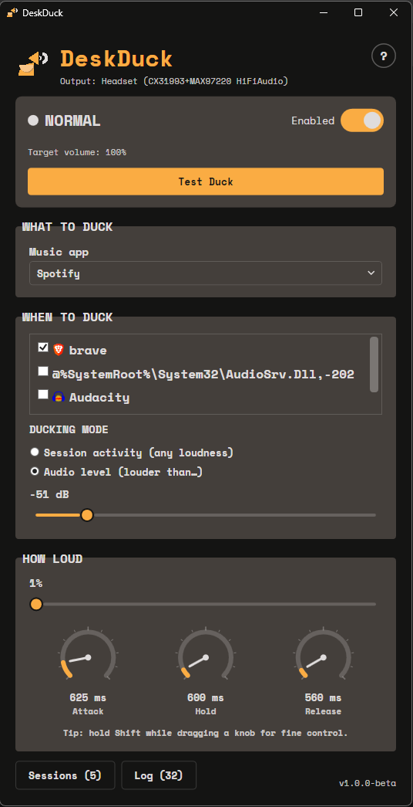
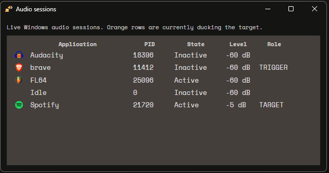
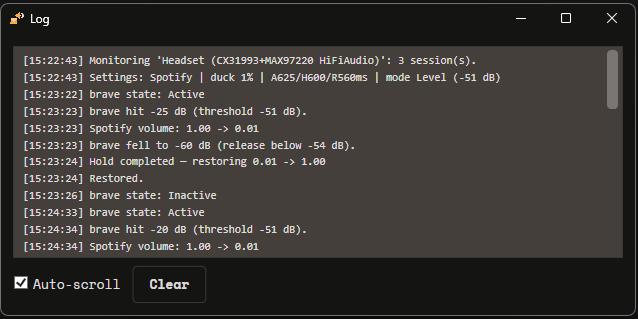
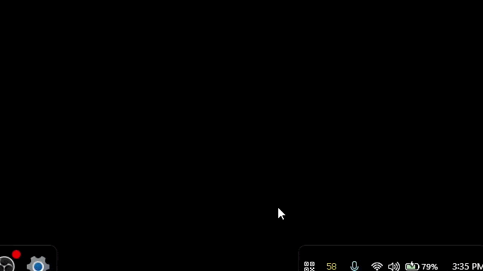

# DeskDuck

<p align="center">
  
</p>

<p align="center">
  <strong>A small Windows utility that keeps background music out of the way when another app needs your attention.</strong>
</p>

<p align="center">
  
  
  
  
</p>

## Contents

- [See It In Action (Demo)](#see-it-in-action)
- [Take A Look Around (Screenshots/GIFs)](#take-a-look-around)
- [Why DeskDuck?](#why-deskduck)
- [How It Works](#how-it-works)
- [What You Can Control](#what-you-can-control)
- [A Typical Setup](#a-typical-setup)
- [Understanding The Settings](#understanding-the-settings)
- [Sessions Window](#sessions-window)
- [Log Window](#log-window)
- [System Tray](#system-tray)
- [Volume Safety](#volume-safety)
- [Requirements](#requirements)
- [Download And Run](#download-and-run)
- [Build From Source](#build-from-source)
- [Troubleshooting](#troubleshooting)
- [A Note About The Beta](#a-note-about-the-beta)
- [For Developers](#for-developers)
- [License](#license)

## See It In Action

https://github.com/user-attachments/assets/becdb9d4-a428-4406-b764-2e03b87d9025

## Take A Look Around

### DeskDuck Main Window



See section: [How It Works](#how-it-works)

### DeskDuck Audio Sessions Window



See section: [Sessions Window](#sessions-window)

### DeskDuck Log Window



See section: [Log Window](#log-window)

### DeskDuck System Tray



See section: [System Tray](#system-tray)

## Why DeskDuck?

Sometimes you want music playing in the background while you work. Then another application starts playing something you actually need to hear, and suddenly your music is competing with it.

DeskDuck takes care of that little annoyance automatically.

Choose the app you use for background music, choose which other apps should get priority, and DeskDuck lowers the music while those apps are actively playing audio. When they're finished, your music comes back smoothly.

You can use it with whatever desktop apps you already have. Music players, browsers, creative software, game engines, media players, meeting apps, and other programs can all fit into the same setup as long as Windows gives them an audio session.

## How It Works

Windows keeps track of audio activity separately for desktop applications. DeskDuck uses that information to decide when your background music should step aside.

You choose:

* **The app to duck:** the one whose volume DeskDuck controls.
* **The apps that can trigger a duck:** the applications whose audio should take priority.
* **How DeskDuck should detect playback:** either by activity or by audio level.

### Session activity

Session activity is the mode to use when you want **any amount of playback to count**.

When a selected app is actively producing audio, DeskDuck lowers your music and keeps it there for as long as that audio session remains active. The actual loudness does not matter, so very quiet ambience and subtle background sounds still count.

This is useful when you're working with audio that you need to hear even when it's intentionally quiet.

### Audio level

Audio level mode is useful when you only want louder sounds to interrupt your music.

Set a threshold and DeskDuck responds when a selected app's audio reaches it. The release point sits slightly below the threshold so the volume does not constantly bounce around when a sound is hovering near the boundary.

## What You Can Control

### Target app
Pick the desktop application whose volume should be lowered.

### Trigger apps
Choose which applications are allowed to interrupt your background music.

### Detection mode
Choose between session activity and audio level depending on how you want DeskDuck to behave.

### Duck amount
Decide how much of your normal music volume should remain while another app is playing.

### Attack
Control how quickly the music moves down.

### Hold
Give DeskDuck a little time before restoring the music after playback stops.

### Release
Control how quickly the music returns.

### Sessions
See which applications Windows currently recognizes as producing audio and which one is responsible for the current duck.

### Log
Review what DeskDuck detected and when it changed the music volume.

### The system tray
Close the main window without stopping DeskDuck. It can continue working quietly in the background until you exit it from the tray.

## A Typical Setup

1. Open DeskDuck and choose your background music app under **WHAT TO DUCK**.
2. Under **WHEN TO DUCK**, select the applications whose audio should take priority.
3. Choose **Session activity** when you want even very quiet playback to duck the music. Choose **Audio level** when only louder sounds should interrupt it.
4. Turn **Enabled** on.
5. Adjust the duck amount and timing until it feels right for you.

You can also use **Test Duck** to hear the transition without starting another application.

## Understanding The Settings

| Setting              | What it does                                                                   |
| -------------------- | ------------------------------------------------------------------------------ |
| **Target app**       | The application whose volume DeskDuck controls.                                |
| **Trigger apps**     | The applications whose audio can cause the target to duck.                     |
| **Session activity** | Dips the target while a selected app is actively producing audio.              |
| **Audio level**      | Dips the target when a selected app's audio passes your chosen threshold.      |
| **Duck**             | Sets how much of the target's normal volume remains while ducked.              |
| **Attack**           | Controls how quickly the target volume moves down.                             |
| **Hold**             | Sets how long DeskDuck waits after playback stops before restoring the volume. |
| **Release**          | Controls how quickly the target volume returns to normal.                      |

The default response is:

| Setting |              Default |
| ------- | -------------------: |
| Duck    | 25% of normal volume |
| Attack  |               100 ms |
| Hold    |               400 ms |
| Release |               800 ms |

These values are starting points rather than rules. Adjust them to match the way you work and listen.

## Sessions Window

The **Sessions** window is there for those moments when you wonder why DeskDuck did or didn't duck your music.

It shows the audio sessions currently known to Windows along with their application, state, current level, and role in DeskDuck.

The important state in activity mode is **ACTIVE**. An application being open is not enough by itself. DeskDuck is looking for an active audio session.

This also makes the window useful for checking how a particular application behaves on your system.

## Log Window

The **Log** window records important events such as:

* applications appearing as audio sessions
* session state changes
* ducking starting or stopping
* target volume changes
* target recovery after an interrupted ducking cycle

When something behaves unexpectedly, the log gives you a history of what DeskDuck saw.

## System Tray

DeskDuck is meant to stay out of your way once you've configured it.

Closing the main window hides it in the system tray rather than ending the application. From there you can reopen the main window, toggle automatic ducking, run **Test Duck**, open the Sessions or Log windows, or exit DeskDuck completely.

## Volume Safety

DeskDuck keeps track of the target application's volume before it starts ducking.

That lets it restore the volume you were actually using instead of replacing it with a fixed value. It also keeps a saved copy of the pre-duck volume so it can recover cleanly if the target application disappears during a ducking cycle or DeskDuck is closed before restoration finishes.

## Requirements

DeskDuck is built for **Windows 10 and Windows 11**.

Windows 11 is required for a few visual details in the window chrome; the core application is designed around Windows desktop audio.

To build DeskDuck from source, install the **.NET 10 SDK**.

## Download And Run

The easiest way to use DeskDuck is to download a build from the repository's **Releases** page.

Extract the release package and launch `DeskDuck.exe`.

DeskDuck works locally on your computer. Its audio monitoring and volume control use Windows' own desktop audio system, so there is no account setup involved.

## Build From Source

Open `DeskDuck.slnx` in Visual Studio, or build from the solution root:

```powershell
dotnet build
```

To launch the debug build from PowerShell:

```powershell
Start-Process .\DeskDuck\bin\Debug\net10.0-windows\DeskDuck.exe
```

DeskDuck stores its settings here:

```text
%AppData%\DeskDuck\settings.json
```

The settings file is plain JSON and is recreated with safe defaults if it contains invalid values.

## Troubleshooting

### 1. The music never ducks

Check that DeskDuck is enabled, the correct target application is selected, and at least one trigger application is checked.

In **Session activity** mode, the trigger application must be actively producing audio. Simply having the application open is not enough.

### 2. The music stays quiet

DeskDuck remembers the volume from before the ducking cycle and uses that value when restoring the target.

If the target disappears while it is ducked, DeskDuck keeps that saved value and can reconcile it when the target returns.

### 3. An application behaves differently than expected

Different desktop applications handle their audio differently, and some also change their behavior depending on their audio settings or driver.

Open **Sessions** and watch the application's state while starting and stopping playback. That shows exactly what DeskDuck is seeing from Windows.

### 4. An application does not appear in the list

DeskDuck discovers applications from the audio sessions currently known to Windows.

Starting playback in the application should normally make it appear, and newly created audio sessions are picked up while DeskDuck is running.

## A Note About The Beta

DeskDuck is currently a **v1.0.0-beta** release.

The main workflow is in place, but desktop audio behavior can vary from one application and audio driver to another. The Sessions and Log windows are included specifically to make those differences easier to understand.

Bug reports, feedback, and unusual use cases are welcome.

This started as a tiny personal annoyance. It would be pretty cool if it ended up being useful to somebody else, too.

## For Developers

DeskDuck is a native WPF desktop application built with C# and NAudio around Windows audio sessions.

The main project areas are:

```text
DeskDuck/
├── Audio/
├── Controls/
├── Core/
├── Models/
├── Resources/
├── Services/
├── ViewModels/
├── Views/
└── Assets/
```

The core of the application lives in the session monitor, volume controller, ducking engine, settings service, and tray integration.

## License

This project is licensed under the MIT License - see the [LICENSE](LICENSE) file for details.
